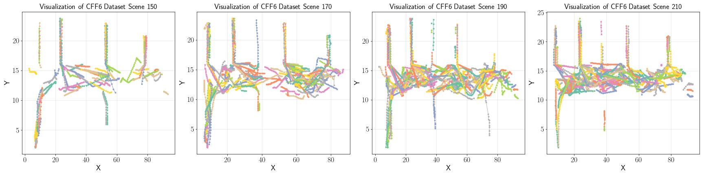
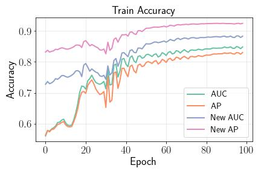

# 🚗 Trajectory Prediction

A repository of trajectory prediction models (PyTorch Base).

## 💡 Introduction

The goal of *trajectory prediction* is to predict future positions given their previous positions. These trajectories can be pedestrians or cars. This is a challenging task that is gaining increasing attention in recent years because its applications are becoming more and more relevant. These applications include human surveillance, socio-robot navigation and [autonomous driving](https://www.sciencedirect.com/topics/computer-science/autonomous-driving). 

This is my first try on this research direction. I choose to implement some models to extend my knowledge about this. For now, this repo has:

Dataset: 

- TrajNet++ CFF6 dataset init and visualization; [Dataset Link](https://github.com/vita-epfl/trajnetplusplusbaselines)
- VGRNN [1] Facebook dataset init and visualization. [Dataset Link](https://github.com/VGraphRNN/VGRNN/tree/master/data/fb)

Model: 

- VGRNN (modified from [Giggle2526](https://github.com/Giggle2526/VGRNN))
- ~~EvolveGraph~~

## 🔧 Environment

```
Python Version: Tested in Python 3.9
Python Packages: torch, torch_geometric, networkx, etc
```

## 📁 Structure

```
.
├── config
├── data/
│   ├── cff
│   └── fb
├── fig
├── notebook
└── src
```

- `config`: model training parameters
- `data/cff`: TrajNet++ CFF6 dataset, `cff_06.ndjson` 150MB (you download by yourself)
- `data/fb`: VGRNN Facebook dataset (already included)
- `notebook`: some examples of dataset visualization and model training are here

## 📖 Guide

**Step 1.** [Download] or [Clone] this repository;

**Step 2.** Install require packages: `pip insall -r requirement.txt`;

**Step 3.** Check `notebook/00_datasete.ipynb` to have ideas about two datasets;

**Step 4.** Check `notebook/01_vgrnn.ipynb` to see the useage of VGRNN model.

## 📊 Examples

### VGRNN Dataset Visualization
This figure is referred from the [original repository](https://github.com/VGraphRNN/VGRNN). I think this is cooler. 
<p align="center">

</p>

### TrajNet++ CFF6 Dataset Visualization
I randomly choose four scenes to show: 150, 170, 190, 210.
<p align="center">

</p>

### VGRNN Training Accuracy
For hyperparaeters, please refer to `confg/vgrnn_args.py`.
<p align="center">

</p>


## 📜 Reference

[1] Hajiramezanali, Ehsan, et al. "Variational graph recurrent neural networks." *Advances in neural information processing systems* 32 (2019).
